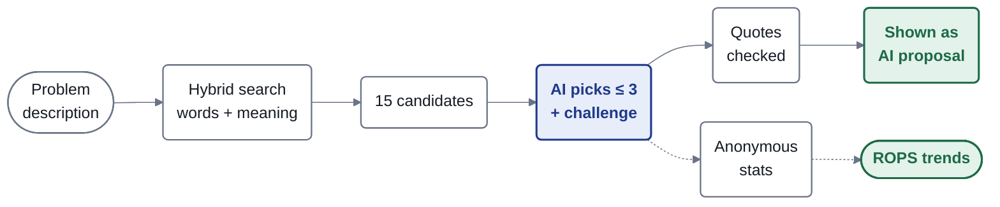
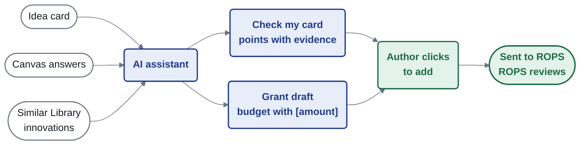
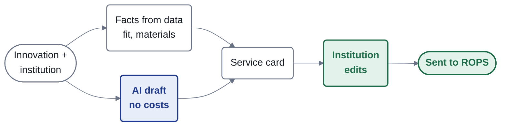

# How AI works in HubMI

Four pictures for the jury. Blue = AI step, white = data and checks computed by code, green = a person decides.
Nothing the AI writes is published or sent without a human click, and every AI text in the app carries the label „Propozycja AI”.

## 1. Overview

Personal data (phone, e-mail, PESEL) is removed before anything reaches the model. The model answers in JSON, which is validated; it may only pick from the identifiers it was given.

```mermaid
%%{init: {"theme":"base","themeVariables":{"background":"#FFFFFF","primaryColor":"#FFFFFF","primaryBorderColor":"#1F3A8A","primaryTextColor":"#151A23","lineColor":"#6B7487","fontFamily":"Inter, Arial, Liberation Sans, Noto Sans, sans-serif","fontSize":"16px"},"flowchart":{"curve":"basis","nodeSpacing":40,"rankSpacing":50,"padding":14,"wrappingWidth":260}}}%%
flowchart LR
    U(["Resident or<br/>institution"]):::data --> P("Remove<br/>personal data"):::data
    P --> S("Search<br/>BM25 + vectors"):::data
    S --> M("AI model<br/>DeepSeek"):::ai
    M --> V("Validate<br/>answer"):::data
    V --> H("Human decides"):::human
    H --> R(["ROPS"]):::human
    classDef ai fill:#E8EDFA,stroke:#1F3A8A,stroke-width:2px,color:#1F3A8A,font-weight:bold
    classDef data fill:#FFFFFF,stroke:#6B7487,stroke-width:1.5px,color:#151A23
    classDef human fill:#E3F2EA,stroke:#1D6B48,stroke-width:2px,color:#1D6B48,font-weight:bold
```

## 2. Matchmaking

The ranking comes first, without AI (keywords + meaning, 0.8 vectors / 0.2 keywords). The AI then picks at most 3 of 15 candidates and one challenge of the 48 on the Challenges Map. Quotes are checked word for word. Only the area and the challenge are stored for ROPS trends, never the description.

## 3. Idea creator

„Check my card” points out what to change, each point with its evidence: the author's canvas answer or a quote from a similar Library innovation. The grant draft uses the canvas; the budget lists the costs the author ticked, each with [amount].

## 4. Middleman

Fit and materials are computed from ROPS data, not by AI. The AI drafts the service card without costs; the institution edits it and sends it to ROPS.

## Measured results

| What | Result |
|---|---|
| ROPS test set, 230 queries: right innovation in top 3 | **100%** |
| Everyday descriptions (40) / unusual queries (41): top 3 | **100% / 98%** |
| Right challenge from the Challenges Map, with AI (48) | **96%** |
| Problems outside the Library flagged as „no match” (80) | **94%** |

Source: `evals/results.md`. Images for slides: `pitch/diagramy/ai-*.png` (rendered with mermaid-cli from the `.mmd` files next to them, style in `render.css`).
