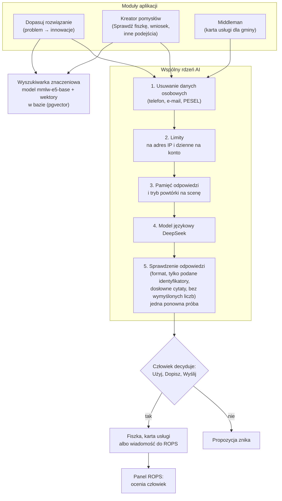
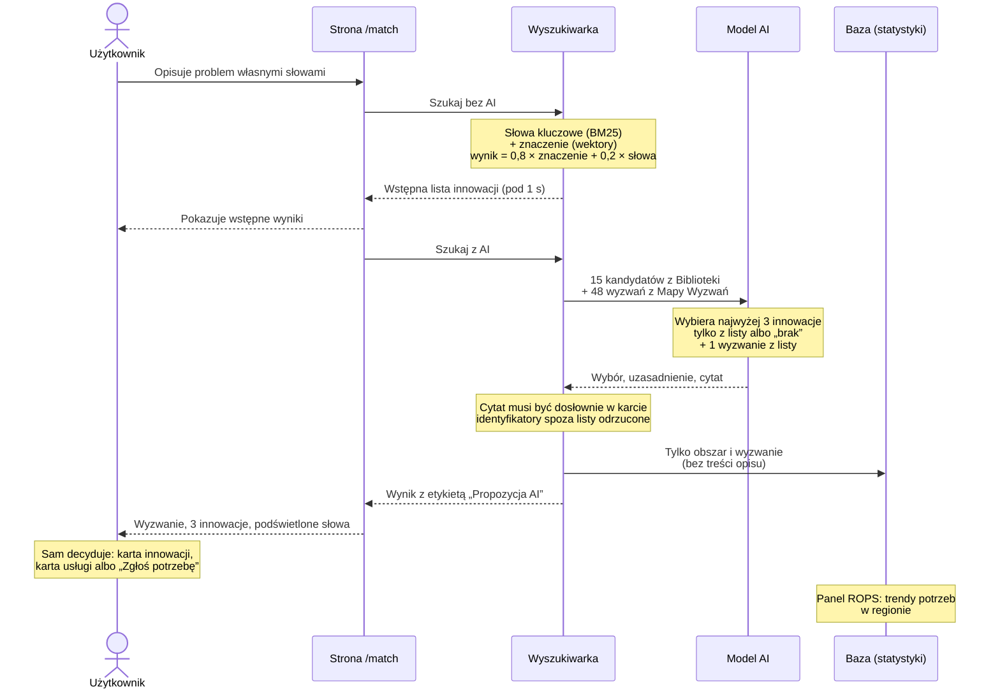
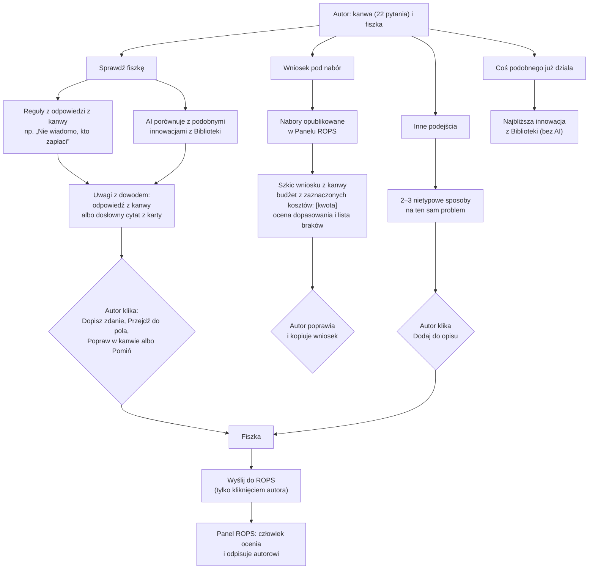
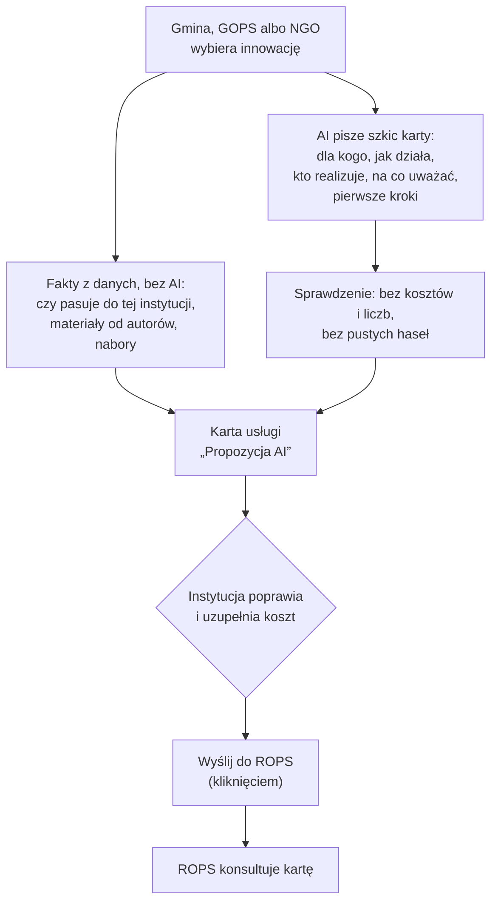

# Jak działa AI w HubMI

Materiał do prezentacji i decku (#28). Każdy diagram pokazuje, **gdzie decyduje człowiek**.
Zasada w całej aplikacji: AI tylko proponuje. Nic z AI nie jest publikowane, zapisywane w fiszce
ani wysyłane do ROPS bez kliknięcia człowieka, a każdy tekst z AI ma etykietę „Propozycja AI”.

## 1. Całość: gdzie aplikacja używa AI

Cztery miejsca korzystają z jednego, wspólnego „rdzenia”. Rdzeń pilnuje bezpieczeństwa i jakości,
zanim cokolwiek trafi do modelu i zanim odpowiedź trafi do człowieka.

Co dzieje się w rdzeniu:

- **Dane osobowe** są usuwane, zanim tekst wyjdzie z aplikacji (`lib/ai/privacy.ts`).
- **Limity** chronią budżet: 20 zapytań AI na godzinę z jednego adresu w wyszukiwarce, 30 w Kreatorze
  i Middlemanie, do tego 100 dziennie na konto (`ai_usage`).
- **Pamięć odpowiedzi** (`ai_cache`) sprawia, że to samo pytanie nie kosztuje drugi raz.
  **Tryb powtórki** (`AI_REPLAY`) odtwarza nagrane odpowiedzi na scenie, nawet gdy sieć zawiedzie.
- **Model wybiera tylko z tego, co dostał**: z listy innowacji, wyzwań albo odpowiedzi z kanwy.
  Odpowiedź spoza listy jest odrzucana, cytat, którego nie ma w karcie, znika.

## 2. Dopasuj rozwiązanie (moduł I)

Mieszkaniec, gmina albo organizacja opisuje problem własnymi słowami. Najpierw w ułamku sekundy
pokazujemy wyniki wyszukiwarki, a AI w tym czasie wybiera najlepsze i uzasadnia wybór.

Gdy w Bibliotece nie ma rozwiązania, strona mówi to wprost („takiego rozwiązania jeszcze nie ma”)
i proponuje zgłoszenie potrzeby do ROPS, zamiast udawać dopasowanie.

## 3. Kreator pomysłów (moduł III)

AI nie przepisuje fiszki za autora. Wskazuje, co zmienić i skąd to wie.

- **Sprawdź fiszkę** łączy reguły policzone z kanwy (zawsze prawdziwe) z najwyżej trzema uwagami AI.
  Każda uwaga ma źródło: pytanie z kanwy albo cytat z podobnej innowacji z linkiem do karty.
- **Wniosek pod nabór**: AI nie wpisuje liczb ani kwot. Budżet to lista kosztów zaznaczonych przez
  autora w kanwie, każdy z miejscem `[kwota]` do uzupełnienia.

## 4. Middleman (moduł VII)

Gmina, ośrodek pomocy albo organizacja zamienia innowację z Biblioteki w kartę usługi, którą może
zamówić i sfinansować.

## 5. Wyniki pomiarów

Zmierzone na zestawach testowych (`evals/results.md`):

| Co mierzymy | Wynik |
|---|---|
| Właściwa innowacja w pierwszej trójce, 230 pytań od ROPS | **100%** |
| To samo dla pytań potocznych (40) i nietypowych: literówki, bez polskich znaków, po ukraińsku (41) | **100%** i **98%** |
| Właściwe wyzwanie z Mapy Wyzwań, gdy wybiera AI (48 pytań) | **96%** |
| Problemy spoza Biblioteki rozpoznane jako „brak rozwiązania” (80 pytań) | **94%** |

Wymaganie ROPS: co najmniej 80% w pierwszej trójce.
