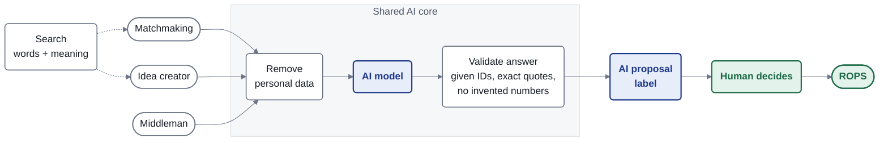
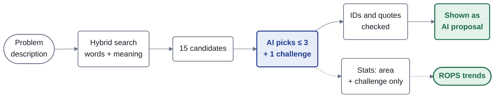
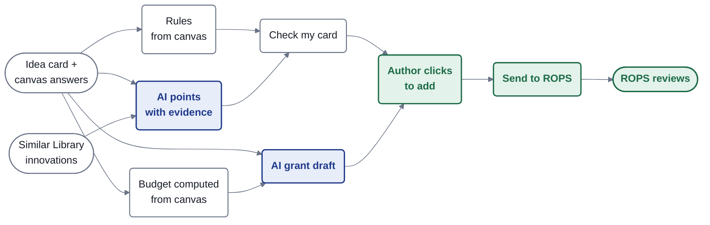

# How AI works in HubMI

Four pictures for the jury. Blue = AI step, white = data and checks computed by code, green = a person decides.
Nothing the AI writes is published or sent without a human click, and every AI text in the app carries the label „Propozycja AI”.

## 1. Overview

Three modules share one AI core. Personal data (phone, e-mail, PESEL) is removed before anything reaches the AI model (the provider is configurable). The answer is validated: only the identifiers it was given, quotes copied word for word, no invented numbers. Search by words and meaning feeds Matchmaking and the Idea creator.

## 2. Matchmaking

The ranking comes first, without AI (keywords + meaning, 0.8 vectors / 0.2 keywords). The AI then picks at most 3 of 15 candidates and one challenge of the 48 on the Challenges Map. Quotes are checked word for word. Only the area and the challenge are stored for ROPS trends, never the description.

## 3. Idea creator

„Check my card” combines rules computed from the canvas with AI points, each with its evidence (the author's canvas answer or a quote from a similar Library innovation). The grant draft is written by AI from the card and canvas; its budget is computed by code from the costs the author ticked, each with [amount]. Nothing is added without the author's click, and sending to ROPS is a separate step.

## 4. Middleman

Fit and materials are computed from ROPS data, not by AI. The AI drafts the service card without costs; the institution edits it and sends it to ROPS.

## Measured results

| What | Result |
|---|---|
| ROPS test set, 230 queries: right innovation in top 3 | **100%** |
| Everyday descriptions (40) / unusual queries (41): top 3 | **100% / 98%** |
| Right challenge from the Challenges Map, with AI (48) | **96%** |
| Problems outside the Library flagged as „no match” (80) | **94%** |

Source: `evals/results.md`. Images for slides: `pitch/diagramy/ai-*.png` (rendered with mermaid-cli from the `.mmd` files next to them, style in `render.css`).
